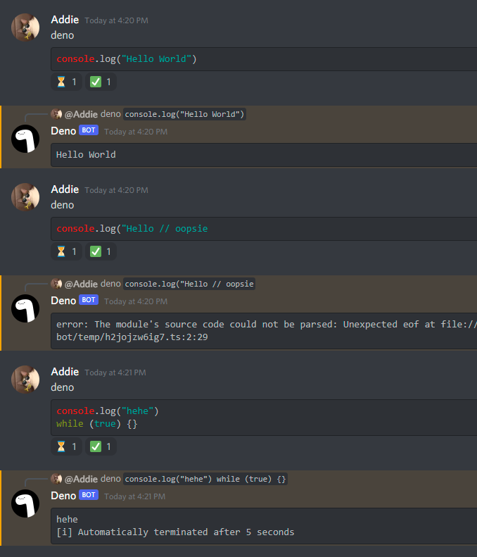

<p align="center">
  
</p>

# Deno bot

## 👋 Intro
This is just a proof of concept, of a Discord bot, which can execute any `.ts` code, submitted by users via discord messages. Bot itself is written for the node enviroment, but the enviroment, where user-submitted code is running, is **[Deno](https://deno.land/)**.

## 📕 Backstory
The idea of this bot isn't new at all. There are bots which are doing essentially the same thing, but this one is *built different* (I hope so). I wanted to make a bot like this for a long time, but I couldn't figure out one thing - **how to make it secure**. Security for this kind of a program is crucial, since it is running user-submitted code on a server. Node enviroment isn't well suited for this task, since you have access to the network and filesystem out of the box, whatsoever. 

A little while ago, I watched this [video](https://www.youtube.com/watch?v=SYkzk_j3yb0) on YouTube about Deno, and there where multiple cool things, right out of the box, which surprised me:
- Native TypeScript support out of the box
- The whole enviroment is packed into a single binary
- Security out of the box, meaning that you can't use file system or network, without explicitly telling deno to do so.

First point is kinda nice-to-have, but the last two points are quite important for me. Having the whole enviroment in one single binary would make this project a bit more compact, and the security out of the box is just simply perfect.

## 👀 Examples
To run any message as a script, just type in
````
deno ```ts
const sum = (a: number, b: number): number => {
  return a + b
}

console.log(sum(5, 4))
```
````

By default, only two "paralell" executions are allowed, but this number can be change with `deno set limit <max limit>` command.
Also, code which takes more than 5 seconds to run will be killed automatically. Feel free to test it yourself. 🤠

One thing to mention, your code is evaluated as JS by default, but you can use TypeScript if you want, just by writing ts at the beginning of your code.
````
deno ```ts
console.log("hehe, loop goes brr")
while(true) {}
```
````
Screenshot of the actual output




## 🚩 Important info
You need to have the [Node](https://nodejs.org/en/) enviroment installed on your machine.
In order to run this on your discord server, you will need to register a new discord application and a bot at https://discord.com/developers.
To run the actual code you have to install dependencies using `npm install` command, and then just use command `npm run dev` or `npm run start`.

## 🤖 TODO
- Comments
- ~~Dockerfile~~
- Refactoring maybe ?
---
Feel free to open any issue :)